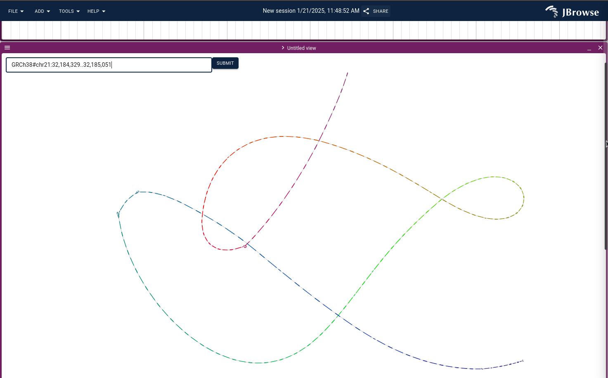

# jbrowse-plugin-graphgenomeviewer

WIP for displaying graph genome as a view in JBrowse 2

## Screenshot

## Concept

The code adds:

- a simple file selector for the user to open .gfa files to display alognside
  the genome browser (these are meant to be locus-specific smallish GFA, not
  full assembly graphs)
- alternatively, can configure a "GFA server" which will use the `vg chunk`
  command to extract the region into a web based bandage-like graph genome
  viewer https://github.com/cmdcolin/graphgenomeviewer

## Thanks

To the StableGenomics team for their PAG workshop helping explain some vg
toolkit commands and concepts https://github.com/StableGenomics/PangPAG

## TODOs

Shortlist of TODOs

- Easier navigation between the linear genome view and graph genome panel
- Ability to launch a synteny-style view from the graph
- Ability to use decompose graph into VCF track
- Ability to show paths/walks
- Debug issue where vg chunk GFA output not loadable in bandage
- Improve scalability
- Bi-directional mouseover from genome to graph and back
- Less chunk-y-ness from the vg chunk graph (?)
